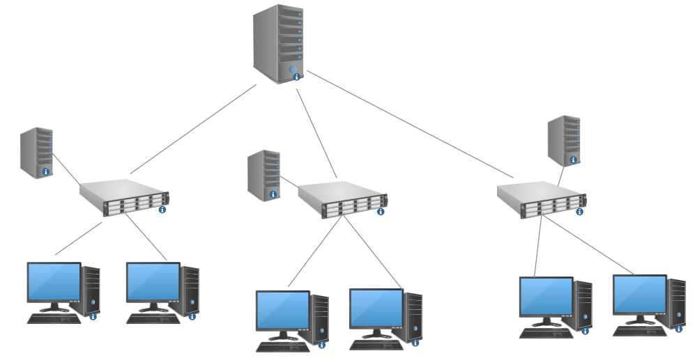

# Introduction

This repo is a simulation for DDoS in SDN Network.
Using Ryu as controller, Mininet as network simulator, and OVSwitch as SDN switch.

 

In this Simulation Network, We have 3 SDN switches that act as simple router, and 1 Master Controller control all switch, furthermore, there are 3 slave controller act as flow table inspactor for each switch

For Hosts, There are three subdomain, each containe 2 host, host number 1 and 2 for sundomain 1, than 3 and 4 for subdomain 2 and so on. There are 2 host run a nodejs simple server and other host would request for every sec.


# Quick Start

1. install simple node server
```
cd mock
npm install
```
2. setup slave controller as mointor
```
ryu-manager --ofp-tcp-listen-port 6553 slave.py
ryu-manager --ofp-tcp-listen-port 6453 slave.py
ryu-manager --ofp-tcp-listen-port 6353 slave.py
```
3. start topo
```
sudo python3 topo.py
```
4. wait for slave controller about 3 min for collection and training RNN model for detection.

5. smulation attack
```
xterm h1
hping3  --flood --rand-source 172.16.10.11
```
6. And In Slave controller should show some alert about DDoS.


## Environment 
1. linux env. (because ovs need to run as linux kernal module)
2. ryu and mininet package for root user.
3. curl.
4. nodejs and npm package manager
5. python 3.8 version. 
6. tensorflow, pandas, scikit-learn, numpy
    - tensorflow: ```2.8.0 ```
    - pandas: ```1.4.1```
    - numpy: ```1.22.3```
    - scikit-learn: ```1.0.2```

## Reference
1. ryu: https://ryu-sdn.org/
2. mininet: http://mininet.org/
3. OVSwitch: https://www.openvswitch.org/